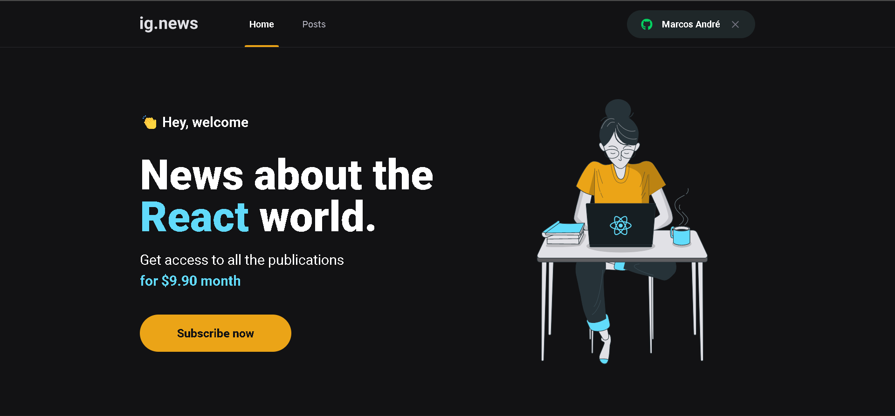

<div align="center">
	
</div>

## :dart: Objetivo

Blog com serviço de assinatura em Next.js.

## :hammer_and_wrench: Ferramentas

- [axios](https://axios-http.com/ptbr/docs/intro)
- [faunadb](https://fauna.com/)
- [next.js](https://nextjs.org/)
- [next-auth](https://next-auth.js.org/)
- [prismic](https://prismic.io/)
- [sass](https://sass-lang.com/)
- [stripe](https://stripe.com/docs)

## :desktop_computer: Padronização de código

- [Eslint](https://eslint.org/)
- [Prettier](https://prettier.io/)
- [EditorConfig](https://editorconfig.org/)

## :rocket: Executando o projeto

```bash
// Instale as dependências

yarn install

// Concluindo a instalação rode

yarn dev
```
